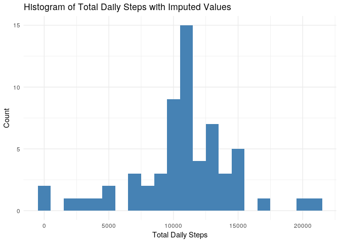
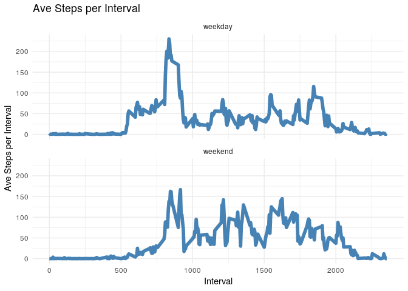

Load libraries and set code chunk defaults.


```r
library(readr)
library(ggplot2)
library(dplyr)
knitr::opts_chunk$set(echo = TRUE)
```

## Loading and preprocessing the data

Load the data and display the first 6 rows.


```r
file <- "activity.zip"
df <- read_csv(file)
```

```
## Parsed with column specification:
## cols(
##   steps = col_integer(),
##   date = col_date(format = ""),
##   interval = col_integer()
## )
```

```r
print(head(df))
```

```
## # A tibble: 6 x 3
##   steps date       interval
##   <int> <date>        <int>
## 1    NA 2012-10-01        0
## 2    NA 2012-10-01        5
## 3    NA 2012-10-01       10
## 4    NA 2012-10-01       15
## 5    NA 2012-10-01       20
## 6    NA 2012-10-01       25
```

## What is mean total number of steps taken per day?


```r
daily <- df %>%
  na.omit() %>%
  group_by(date) %>%
  summarize(total = sum(steps))

ggplot(data=daily, aes(daily$total)) +
  geom_histogram(binwidth = 1000, fill="steelblue") +
  theme_minimal() +
  labs(title = "Histogram of Total Daily Steps",
       x = "Total Daily Steps",
       y = "Count")
```

<!-- -->


```r
mean.steps <- format(mean(daily$total), scientific = FALSE)
median.steps <- format(median(daily$total), scientific = FALSE)
```

**Total number of steps taken each day**

- **Mean**:  10766.19
- **Median**:  10765


## What is the average daily activity pattern?

```r
by.interval <- df %>%
  na.omit() %>%
  group_by(interval) %>%
  summarize(ave = mean(steps))

ggplot(data = by.interval, aes(x = interval, y = ave))+
  geom_line(color = "steelblue", size = 2) +
  theme_minimal() +
  labs(title = "Time Series of Ave Steps per Interval",
       x = "Interval",
       y = "Ave Steps per Interval")
```

<!-- -->


```r
max.interval.id <- which(by.interval$ave == max(by.interval$ave))
max.interval <- by.interval$interval[max.interval.id]
max.interval
```

```
## [1] 835
```
Interval **835** contains the maximum number of steps across all days (206.1698113 steps).

## Imputing missing values
Calculate the total number of missing values from the entire data set.


```r
na.count <- sapply(df, function(x) sum(is.na(x)))
na.count
```

```
##    steps     date interval 
##     2304        0        0
```

```r
na.steps <- na.count[1]
na.steps
```

```
## steps 
##  2304
```

Only the `steps` column contained NA's, which the total number of rows with NA's in the `steps` column is **2304**.

Use the mean total daily steps to impute missing values for `steps` and verify that there are no more NA's.


```r
imputed <- df %>%
  left_join(by.interval, by = "interval") %>%
  mutate(steps = ifelse(is.na(steps), ave, steps)) %>%
  select(-ave)

sum(is.na(imputed$steps))
```

```
## [1] 0
```

```r
dim(imputed)
```

```
## [1] 17568     3
```

```r
dim(df)
```

```
## [1] 17568     3
```

There are no more NA's after imputing, and we see that the number of rows match the original data set.


```r
daily.imputed <- imputed %>%
  group_by(date) %>%
  summarize(total = sum(steps))

ggplot(data=daily.imputed, aes(daily.imputed$total)) +
  geom_histogram(binwidth = 1000, fill="steelblue") +
  theme_minimal() +
  labs(title = "Histogram of Total Daily Steps with Imputed Values",
       x = "Total Daily Steps",
       y = "Count")
```

<!-- -->


```r
mean.steps.imputed <- format(mean(daily.imputed$total), scientific = FALSE)
median.steps.imputed <- format(median(daily.imputed$total), scientific = FALSE)
```

**Total number of steps taken each day for data set with imputed values**

- **Mean**:  10766.19
- **Median**:  10766.19

The estimates of the mean and median do not really differ from the original data set with NA's. The impact from imputing missing values with the average steps across all days by interval of day is that the distribution of average daily steps is narrower, with more days centered on the mean.

## Are there differences in activity patterns between weekdays and weekends?


```r
weekday.list <- c("Monday", "Tuesday", "Wednesday", "Thursday", "Friday")

df.wkd <- imputed %>%
  mutate(day = weekdays(date),
         day = ifelse(day %in% weekday.list, 1, 0),
         day = factor(day,
                      levels = c(1,0),
                      labels = c("weekday", "weekend")))

by.interval.day <- df.wkd %>%
  group_by(interval, day) %>%
  summarize(ave = mean(steps))

ggplot(data = by.interval.day, aes(x = interval, y = ave))+
  geom_line(color = "steelblue", size = 2) +
  theme_minimal() +
  facet_wrap(~day, ncol = 1, nrow = 2) +
  labs(title = "Ave Steps per Interval",
       x = "Interval",
       y = "Ave Steps per Interval")
```

<!-- -->
