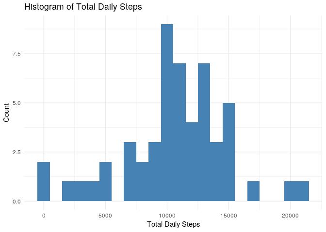
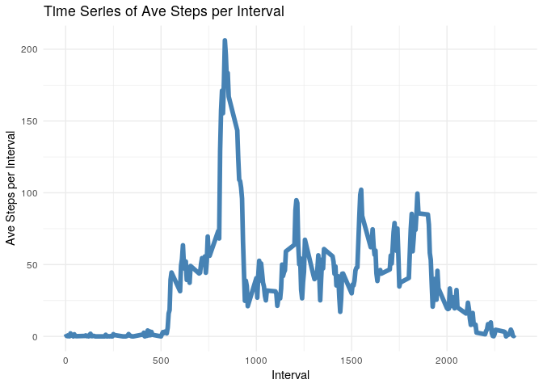

Load libraries and set code chunk defaults.


```r
library(readr)
library(ggplot2)
library(dplyr)
knitr::opts_chunk$set(echo = TRUE)
```

## Loading and preprocessing the data

Load the data and display the first 6 rows.


```r
file <- "activity.zip"
df <- read_csv(file)
```

```
## Parsed with column specification:
## cols(
##   steps = col_integer(),
##   date = col_date(format = ""),
##   interval = col_integer()
## )
```

```r
print(head(df))
```

```
## # A tibble: 6 x 3
##   steps date       interval
##   <int> <date>        <int>
## 1    NA 2012-10-01        0
## 2    NA 2012-10-01        5
## 3    NA 2012-10-01       10
## 4    NA 2012-10-01       15
## 5    NA 2012-10-01       20
## 6    NA 2012-10-01       25
```

## What is mean total number of steps taken per day?


```r
daily <- df %>%
  na.omit() %>%
  group_by(date) %>%
  summarize(total = sum(steps))

ggplot(data=daily, aes(daily$total)) +
  geom_histogram(binwidth = 1000, fill="steelblue") +
  theme_minimal() +
  labs(title = "Histogram of Total Daily Steps",
       x = "Total Daily Steps",
       y = "Count")
```

<!-- -->


```r
mean.steps <- format(mean(daily$total), scientific = FALSE)
median.steps <- format(median(daily$total), scientific = FALSE)
```

**Total number of steps taken each day**

- **Mean**:  10766.19
- **Median**:  10765


## What is the average daily activity pattern?

```r
by.interval <- df %>%
  na.omit() %>%
  group_by(interval) %>%
  summarize(ave = mean(steps))

ggplot(data = by.interval, aes(x = interval, y = ave))+
  geom_line(color = "steelblue", size = 2) +
  theme_minimal() +
  labs(title = "Time Series of Ave Steps per Interval",
       x = "Interval",
       y = "Ave Steps per Interval")
```

<!-- -->


```r
max.interval.id <- which(by.interval$ave == max(by.interval$ave))
max.interval <- by.interval$interval[max.interval.id]
max.interval
```

```
## [1] 835
```
Interval **835** contains the maximum number of steps across all days (206.1698113 steps).

## Imputing missing values

```r
na.count <- sum(is.na(df$steps))
na.count
```

```
## [1] 2304
```
The total number of rows with NA's is **2304**.

## Are there differences in activity patterns between weekdays and weekends?
